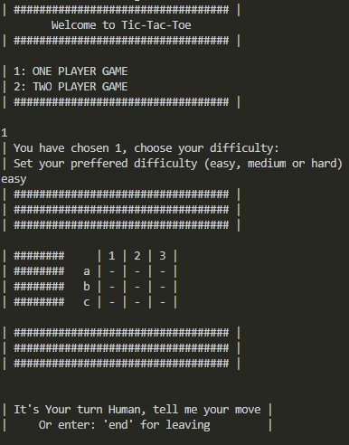
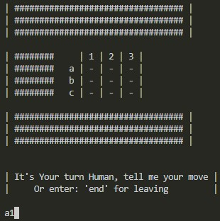
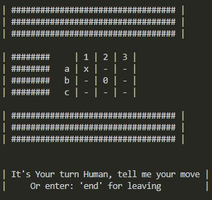

<!-- PROJECT SHIELDS -->
<!--
*** I'm using markdown "reference style" links for readability.
*** Reference links are enclosed in brackets [ ] instead of parentheses ( ).
*** See the bottom of this document for the declaration of the reference variables
*** for contributors-url, forks-url, etc. This is an optional, concise syntax you may use.
*** https://www.markdownguide.org/basic-syntax/#reference-style-links
-->

[![Contributors][contributors-shield]][contributors-url]
[![Forks][forks-shield]][forks-url]
[![Stargazers][stars-shield]][stars-url]
[![Issues][issues-shield]][issues-url]
[![MIT License][license-shield]][license-url]
[![LinkedIn][linkedin-shield]][linkedin-url]

<!-- PROJECT LOGO -->
<br />
<p align="center">
  <a href="https://github.com/jdmartinez1062/Tic-Tac-Toe">
    
  </a>

  <h3 class ="norse" align="center" style="@font-face {font-family: 'Norse'; src: url('/fonts/Norse.otf'); font-family:'Norse'}">Object Oriented Programming</h3>

  <p align="center">
    Tic Tac Toe game
    <br />
    <br />
  </p>
</p>

<!-- TABLE OF CONTENTS -->

## Table of Contents

- [Table of Contents](#table-of-contents)
- [About The Project](#about-the-project)
  - [Built With](#built-with)
- [Getting Started](#getting-started)
  - [Prerequisites](#prerequisites)
  - [Installation](#installation)
- [Usage](#usage)
  - [Run](#run)
  - [How to Play](#how-to-play)
    - [Single Player](#single-player)
    - [Two Players](#two-players)
- [Contact](#contact)

<!-- ABOUT THE PROJECT -->

## About The Project
<p align = "center">
  <a href="https://github.com/jdmartinez1062/Tic-Tac-Toe">
    
  </a>
</p>

[Microverse](https://www.microverse.org/) Third Ruby Section Main Curriculum Project "OOP(Object Oriented Programming)"

Project: OOP. [Assignment link](https://www.theodinproject.com/courses/ruby-programming/lessons/oop)


### Built With

- [Ruby](https://www.ruby-lang.org)

## Getting Started

### Prerequisites


* Windows
```sh
https://www.ruby-lang.org/es/documentation/installation/#rubyinstaller
```
* Linux
```sh
sudo apt-get install ruby-full
```
### Installation

1. Clone the repo

```sh
git clone https://github.com/jdmartinez1062/Tic-Tac-Toe
```
<!-- USAGE EXAMPLES -->
## Usage

### Run
In order to run the game you have two options:

1. Console command

    From the project directory:

        bin/main.rb                     
    

2. Executable File

    Got to the project directory, bin folder, and double click main.rb

<!-- CONTACT -->
### How to Play
The object of Tic Tac Toe is to occupy three boxes in a row. You play on a three by three game board. The first player is known as X and the second is 0. Players alternate placing Xs and 0s on the game board until either opponent has three in a row or the board is full. X (first player) always goes first. If no one has three in a row when the board is full, the stalemate is called a cat game(Draw).

  #### Single Player

  To Play a single-player game against the computer do the next steps:
    
1. After executing the game input `1`.
2. Select the difficulty of the computer by writing `easy`, `medium` or `hard`.
3. Select the position you want to play according to the grid, rows go from `a-c` and columns `1-3`, example:


<p align = "center">
  <a href="https://github.com/jdmartinez1062/Tic-Tac-Toe">
    
  </a>
</p>

Yields

<p align = "center">
  <a href="https://github.com/jdmartinez1062/Tic-Tac-Toe">
    
  </a>
</p>


  #### Two Players
1. After executing the game input `2`.
3. Each player selects the position they want to play, as done in the One Player case.


## Contact

Juan David Martínez Cubillos - jd.martinez1062@gmail.com

Jonathan Marín - mesielepush@gmail.com

Project Link: [https://github.com/jdmartinez1062/Tic-Tac-Toe](https://github.com/jdmartinez1062/Tic-Tac-Toe)

<!-- ACKNOWLEDGEMENTS -->


<!-- MARKDOWN LINKS & IMAGES -->
<!-- https://www.markdownguide.org/basic-syntax/#reference-style-links -->

[contributors-shield]: https://img.shields.io/github/contributors/jdmartinez1062/Tic-Tac-Toe.svg?style=flat-square
[contributors-url]: https://github.com/jdmartinez1062/Tic-Tac-Toe/graphs/contributors
[forks-shield]: https://img.shields.io/github/forks/jdmartinez1062/Tic-Tac-Toe.svg?style=flat-square
[forks-url]: https://github.com/jdmartinez1062/Tic-Tac-Toe/network/members
[stars-shield]: https://img.shields.io/github/stars/jdmartinez1062/Tic-Tac-Toe.svg?style=flat-square
[stars-url]: https://github.com/jdmartinez1062/Tic-Tac-Toe/stargazers
[issues-shield]: https://img.shields.io/github/issues/jdmartinez1062/Tic-Tac-Toe.svg?style=flat-square
[issues-url]: https://github.com/jdmartinez1062/Tic-Tac-Toe/issues
[license-shield]: https://img.shields.io/github/license/jdmartinez1062/Tic-Tac-Toe.svg?style=flat-square
[license-url]: https://github.com/jdmartinez1062/Tic-Tac-Toe/blob/master/LICENSE.txt
[linkedin-shield]: https://img.shields.io/badge/-LinkedIn-black.svg?style=flat-square&logo=linkedin&colorB=555
[linkedin-url]: https://linkedin.com/in/othneildrew
[product-screenshot]: imgs/screenshot.jpg

